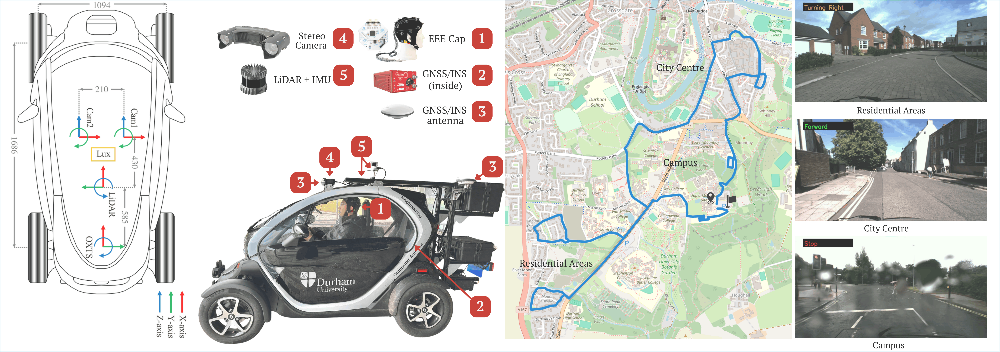

[](https://durham-repository.worktribe.com/output/5186986)
[](https://attend.ieee.org/wcci-2026/)
[](https://arxiv.org/abs/2604.19368)

# Mind2Drive: Predicting Driver Intentions from EEG in Real-world On-Road Driving




---

## Abstract

Predicting driver intention from neurophysiological signals offers a promising pathway for enhancing proactive safety in advanced driver assistance systems, yet remains challenging in real-world driving due to EEG signal non-stationarity and the complexity of cognitive–motor preparation. This study proposes and evaluates an EEG-based driver intention prediction framework using a synchronised multi-sensor platform integrated into a real electric vehicle. A real-world on-road dataset was collected across 32 driving sessions, and 12 deep learning architectures were evaluated under consistent experimental conditions. 
Among the evaluated architectures, TSCeption achieved the highest average accuracy (0.907) and Macro-F1 score (0.901). The proposed framework demonstrates strong temporal stability, maintaining robust decoding performance up to 1000 ms before manoeuvre execution with minimal degradation. Furthermore, additional analyses reveal that minimal EEG preprocessing outperforms  artefact-handling pipelines, and prediction performance peaks within a 400–600 ms interval, corresponding to a critical neural preparatory phase preceding driving manoeuvres. Overall, these findings support the feasibility of early and stable EEG-based driver intention decoding under real-world on-road conditions. Code: https://github.com/galosaimi/Mind2Drive.

---

## News
- **[2026/03]** Mind2Drive accepted at **IEEE WCCI - IJCNN 2026**, Maastricht, The Netherlands.

---

## Overview

Key findings:
- **TSCeption** achieves the best overall performance: **F1 = 0.901**, Balanced Accuracy = **0.907**
- Optimal prediction window: **400-600 ms** before manoeuvre execution
- Minimal EEG preprocessing outperforms aggressive artefact-handling pipelines
- 16-channel EEG outperforms 8-channel across all architectures

---

## Sensor Platform

| Sensor | Model | Rate | Output |
|--------|-------|------|--------|
| EEG | OpenBCI Cyton + Daisy | 125 Hz | 16 channels |
| GPS/INS | OxTS RT3000v3 | 100 Hz | Position, velocity, yaw |
| LiDAR + IMU | Ouster OS1-128 | 10 Hz | 3D point clouds |
| Stereo Camera | Carnegie Robotics Multisense S21 | 30 Hz | RGB 2048x1088 |

---

## Repository Structure

```
Mind2Drive/
├── data_pipeline/
│   ├── 01_extract_rosbag.py
│   ├── 02_label_eeg_images.py
│   ├── 03_split_by_label.py
│   ├── 04_remove_stop_reverse.py
│   ├── 05_validate_thresholds.py
│   └── utils/
│       └── motion_labeling.py
├── preprocessing/
│   ├── normalize.py
│   ├── windowing.py
│   └── oversampling.py
├── models/
│   ├── tsception.py
│   ├── eegnet.py
│   ├── eegconformer.py
│   ├── shallowconvnet.py
│   ├── deepconvnet.py
│   ├── cnn1d.py
│   ├── stnet.py
│   ├── ccnn.py
│   ├── dgcnn.py
│   ├── gru.py
│   ├── lstm.py
│   └── vit.py
├── training/
│   ├── train.py
│   └── evaluate.py
├── configs/
│   └── default.yaml
└── assets/
    └── figures/
```

---

## Results

| Model | Macro-F1 | Bal. Acc |
|-------|----------|----------|
| **TSCeption** | **0.901 +/- 0.003** | **0.907 +/- 0.003** |
| CNN1D | 0.894 +/- 0.002 | 0.899 +/- 0.002 |
| EEGConformer | 0.874 +/- 0.004 | 0.887 +/- 0.004 |
| ShallowConvNet | 0.870 +/- 0.005 | 0.869 +/- 0.005 |
| LSTM | 0.834 +/- 0.008 | 0.843 +/- 0.012 |
| GRU | 0.830 +/- 0.005 | 0.841 +/- 0.004 |
| DGCNN | 0.814 +/- 0.004 | 0.799 +/- 0.009 |
| STNet | 0.805 +/- 0.003 | 0.814 +/- 0.006 |
| CCNN | 0.803 +/- 0.034 | 0.813 +/- 0.045 |
| EEGNet | 0.762 +/- 0.004 | 0.780 +/- 0.004 |
| DeepConvNet | 0.641 +/- 0.012 | 0.472 +/- 0.017 |
| ViT | 0.572 +/- 0.007 | 0.588 +/- 0.019 |

---

## Citation

```
bibtex
@inproceedings{alosaimi26driving,
 author = {Alosaimi, G. and Alhamdan, H. and E, W. and Katsigiannis, S. and Atapour-Abarghouei, A. and Breckon, T.P.},
 title = {Mind2Drive: Predicting Driver Intentions from EEG in Real-world On-Road Driving},
 booktitle = {Proc. Int. Joint Conf. on Neural Networks},
 year = {2026},
 month = {June},
 publisher = {IEEE},
 keywords = {driver intention prediction, eeg, deep neural networks, bci, brain computer interface, brain controlled driving},
 url = {https://breckon.org/toby/publications/papers/alosaimi26driving.pdf},
 note = {to appear},
 category = {automotive bci},
}
```

---

## Links
- [Durham University Repository](https://durham-repository.worktribe.com/output/5186986)
- [IEEE WCCI 2026](https://attend.ieee.org/wcci-2026/)

